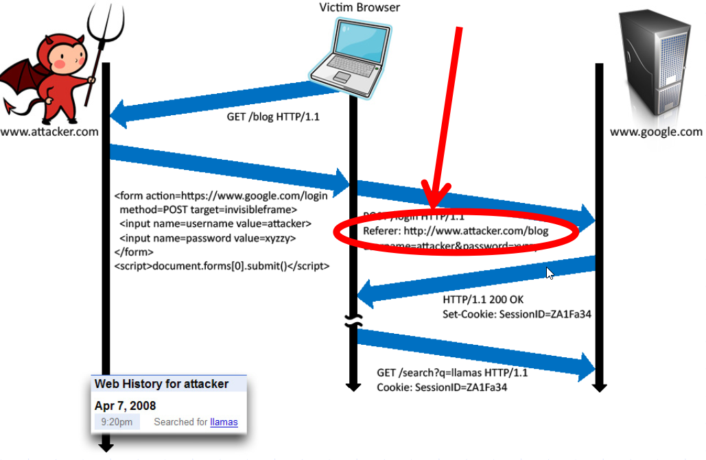

HTTP/TLS
=========

`TLS/SSL` is a cryptographic protocol that allows encryption over otherwise
insecure communication channels. The most common usage of TLS/SSL is to provide
secure `HTTP` communication, also known as `HTTPS`. The protocol ensures that
the following properties apply to the communication channel:

* Privacy
* Authentication
* Data integrity

Its implementation in Go is in the `crypto/tls` package.
In this section we will focus on the Go implementation and usage.
Although the theoretical part of the protocol design and its cryptographic
practices are beyond the scope of this article, additional information is
available on the [Cryptography Practices][1] section of this document.

The following is a simple example of HTTP with TLS:

```go
import "log"
import "net/http"

func main() {
  http.HandleFunc("/", func (w http.ResponseWriter, req *http.Request) {
    w.Write([]byte("This is an example server.\n"))
  })

  // yourCert.pem - path to your server certificate in PEM format
  // yourKey.pem -  path to your server private key in PEM format
  log.Fatal(http.ListenAndServeTLS(":443", "yourCert.pem", "yourKey.pem", nil))
}
```

This is a simple out-of-the-box implementation of SSL in a webserver using Go.
It's worth noting that this example gets an "A" grade on SSL Labs.

To further improve the communication security, the following flag could be added
to the header, in order to enforce HSTS (HTTP Strict Transport Security):
```go
w.Header().Add("Strict-Transport-Security", "max-age=63072000; includeSubDomains")
```

Go's TLS implementation is in the `crypto/tls` package. When using TLS, make
sure that a single standard TLS implementation is used, and that it's
appropriately configured.

Here's an example of implementing SNI (Server Name Indication) based on the
previous example:

```go
...
type Certificates struct {
    CertFile    string
    KeyFile     string
}

func main() {
    httpsServer := &http.Server{
        Addr: ":8080",
    }

    var certs []Certificates
    certs = append(certs, Certificates{
        CertFile: "../etc/yourSite.pem", //Your site certificate key
        KeyFile:  "../etc/yourSite.key", //Your site private key
    })

    config := &tls.Config{}
    var err error
    config.Certificates = make([]tls.Certificate, len(certs))
    for i, v := range certs {
        config.Certificates[i], err = tls.LoadX509KeyPair(v.CertFile, v.KeyFile)
    }

    conn, err := net.Listen("tcp", ":8080")

    tlsListener := tls.NewListener(conn, config)
    httpsServer.Serve(tlsListener)
    fmt.Println("Listening on port 8080...")
}
```

It should be noted that when using TLS, the certificates should be valid, have
the correct domain name, should not be expired, and should be installed with
intermediate certificates when required as recommended in the [OWASP SCP Quick
Reference Guide][2].

**Important:** Invalid TLS certificates should always be rejected.
Make sure that the `InsecureSkipVerify` configuration is not set
to `true` in a production environment.  
The following snippet is an example of how to set this:

```go
config := &tls.Config{InsecureSkipVerify: false}
```

Use the correct hostname in order to set the server name:

```go
config := &tls.Config{ServerName: "yourHostname"}
```

Another known attack against TLS to be aware of is called POODLE. It is related
to TLS connection fallback when the client does not support the server's cipher.
This allows the connection to be downgraded to a vulnerable cipher.

By default, Go disables SSLv3, and the cipher's minimum version and maximum
version can be set with the following configurations:

```go
// MinVersion contains the minimum SSL/TLS version that is acceptable.
// If zero, then TLS 1.0 is taken as the minimum.
  MinVersion uint16
```

```go
// MaxVersion contains the maximum SSL/TLS version that is acceptable.
// If zero, then the maximum version supported by this package is used,
// which is currently TLS 1.2.
MaxVersion uint16
```

The safety of the used ciphers can be checked with [SSL Labs][4].

An additional flag that is commonly used to mitigate downgrade attacks is the
`TLS_FALLBACK_SCSV` as defined in [RFC7507][3]. In Go, there is no fallback.

Quote from Google developer Adam Langley:

> The Go client doesn't do fallback so it doesn't need to send TLS_FALLBACK_SCSV.

Another attack known as CRIME affects TLS sessions that use compression.
Compression is part of the core protocol, but it's optional. Programs written in
the Go programming language are likely not vulnerable, simply because there is
currently no compression mechanism supported by `crypto/tls`. An important
note to keep in mind is if a Go wrapper is used for an external security
library, the application may be vulnerable.

Another part of TLS is related to the connection renegotiation. To guarantee no
insecure connections are established, use the `GetClientCertificate` and its
associated error code in case the handshake is aborted.
The error code can be captured to prevent an insecure channel from being used.

All requests should also be encoded to a pre-determined character encoding such
as UTF-8.
This can be set in the header:

```go
w.Header().Set("Content-Type", "Desired Content Type; charset=utf-8")
```

Another important aspect when handling HTTP connections is to verify that the
HTTP header does not contain any sensitive information when accessing external
sites. Since the connection could be insecure, the HTTP header may leak
information.


Image Credits : [John Mitchell][5]

[1]: ../cryptographic-practices/README.md
[2]: https://www.owasp.org/images/0/08/OWASP_SCP_Quick_Reference_Guide_v2.pdf
[3]: https://tools.ietf.org/html/rfc7507
[4]: https://ssllabs.com/
[5]: https://crypto.stanford.edu/cs155old/cs155-spring14/lectures/09-web-site-sec.pdf
