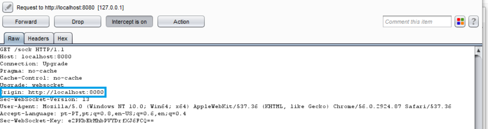
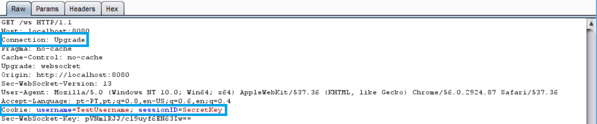
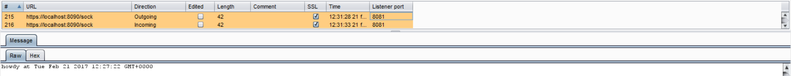

WEBSOCKETS
==========

WebSocket is a new browser capability developed for HTML 5, which enables fully
interactive applications. With WebSockets, both the browser and the server can
send asynchronous messages over a single TCP socket, without resorting to
_long polling_ or _comet_.

Essentially, a WebSocket is a standard bidirectional TCP socket between the
client and the server. The socket starts out as a regular HTTP connection, and
then "Upgrades" to a TCP socket after a HTTP handshake. Either side can send
data after the handshake.

## Origin Header

The `Origin` header in the HTTP WebSocket handshake is used to guarantee that
the connection accepted by the WebSocket is from a trusted origin domain.
Failure to enforce can lead to Cross Site Request Forgery (CSRF).

It is the server’s responsibility to verify the `Origin` header in the initial
HTTP WebSocket handshake. If the server does not validate the origin header in
the initial WebSocket handshake, the WebSocket server may accept connections
from any origin.

The following example uses an `Origin` header check, which prevents
attackers from performing CSWSH (Cross-Site WebSocket Hijacking).



The application should validate the `Host` and the `Origin` to make sure the
request's `Origin` is the trusted `Host`, rejecting the connection if not.

A simple check is demonstrated in the following snippet:

```go
//Compare our origin with Host and act accordingly
if r.Header.Get("Origin") != "http://"+r.Host {
  http.Error(w, "Origin not allowed", 403)
    return
} else {
    websocket.Handler(EchoHandler).ServeHTTP(w, r)
}
```

## Confidentiality and Integrity

The WebSocket communication channel can be established over unencrypted TCP or
over encrypted TLS.

When unencrypted WebSockets are used, the URI scheme is `ws://` and its
default port is `80`.
If using TLS WebSockets, the URI scheme is `wss://` and the default port is
`443`.

When referring to WebSockets, we must consider the original connection and
whether it uses TLS or if it is being sent unencrypted.

In this section we will show the information being sent when the connection
upgrades from HTTP to WebSocket and the risks it poses if not handled
correctly. In the first example, we see a regular HTTP connection being upgraded
to a WebSocket connection:



Notice that the header contains our cookie for the session. To ensure no
sensitive information is leaked, TLS should be used when upgrading our
connection, as shown in the following image:


In the latter example, our connection upgrade request is using SSL, as well as
our WebSocket:



## Authentication and Authorization

WebSockets do not handle Authentication or Authorization, which means that
mechanisms such as cookies, HTTP authentication or TLS authentication must be
used to ensure security. More detailed information regarding this can be found
in the [Authentication][1] and the [Access Control][2] parts of this document.

## Input Sanitization

As with any data originating from untrusted sources, the data should be properly
sanitized and encoded. For a more detailed coverage of these topics, see
the [Sanitization][3] and the [Output Encoding][4] parts of this document.

[1]: ../authentication-password-management/README.md
[2]: ../access-control/README.md
[3]: ../input-validation/sanitization.md
[4]: ../output-encoding/README.md
