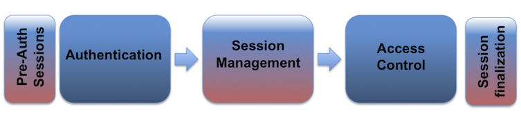

Session Management
==================

In this section we will cover the most important aspects of session management
according to OWASP's Secure Coding Practices. An example is provided along with
an overview of the rationale behind these practices.
Along with this text, there is a folder which contains the complete source code
of the program we will analyze during this section. The flow of the session
process can be seen in the following image:


When dealing with session management, the application should only recognize the
server's session management controls, and the session's creation should be done
on a trusted system. In the code example provided, our application generates a
session using JWT. This is done in the following function:

```go
// create a JWT and put in the clients cookie
func setToken(res http.ResponseWriter, req *http.Request) {
  ...
}
```
We must ensure that the algorithms used to generate our session identifier are
sufficiently random, to prevent session brute forcing.

```go
...
token := jwt.NewWithClaims(jwt.SigningMethodHS256, claims)
signedToken, _ := token.SignedString([]byte("secret")) //our secret
...
```

Now that we have a sufficiently strong token, we must also set
the `Domain`, `Path`, `Expires`, `HTTP only`, `Secure` for our cookies. In this
case the `Expires` value is in this example set to 30 minutes since we are
considering our application a low-risk application.

```go
// Our cookie parameter
cookie := http.Cookie{
    Name: "Auth",
    Value: signedToken,
    Expires: expireCookie,
    HttpOnly: true,
    Path: "/",
    Domain: "127.0.0.1",
    Secure: true
}

http.SetCookie(res, &cookie) //Set the cookie
```

Upon sign-in, a new session is always generated. The old session is never
re-used, even if it is not expired.
We also use the `Expire` parameter to enforce periodic session termination as a
way to prevent session hijacking.
Another important aspect of cookies is to disallow a concurrent login for the
same username. This can be done by keeping a list of logged in users, and
comparing the new login username against this list. This list of active users is
usually kept in a Database.

Session identifiers should never be exposed in URL's. They should only be
located in the HTTP cookie header. An example of an undesirable practice is to
pass session identifiers as GET parameters.
Session data must also be protected from unauthorized access by other users of
the server.

Regarding HTTP to HTTPS connection changes, special care should be taken to
prevent Man-in-the-Middle (MITM) attacks that sniff and potentially hijack the
user's session. The best practice regarding this issue, is to use HTTPS in all
requests. In the following example our server is using HTTPS.

```go
err := http.ListenAndServeTLS(":443", "cert/cert.pem", "cert/key.pem", nil)
if err != nil {
  log.Fatal("ListenAndServe: ", err)
}
```

In case of highly sensitive or critical operations, the token should be
generated per-request, instead of per-session. Always make sure the token is
sufficiently random and has a length secure enough to protect against brute
forcing.

The final aspect to consider in session management, is the **Logout**
functionality. The application should provide a way to logout from all pages
that require authentication, as well as fully terminate the associated session
and connection. In our example, when a user logs out, the cookie is deleted
from the client. The same action should be taken in the location where we store
our user session information.

```go
...
cookie, err := req.Cookie("Auth") //Our auth token
if err != nil {
  res.Header().Set("Content-Type", "text/html")
  fmt.Fprint(res, "Unauthorized - Please login <br>")
  fmt.Fprintf(res, "<a href=\"login\"> Login </a>")
  return
}
...
```

The full example can be found in [session.go](session.go)
