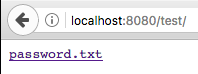
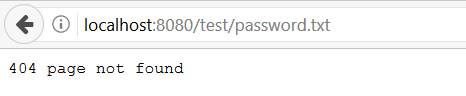
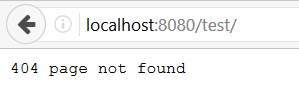
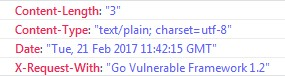

System Configuration
====================

Keeping things updated is imperative in security. With that in mind, developers
should keep Go updated to the latest version, as well as external packages and
frameworks used by the web application.

Regarding HTTP requests in Go, you need to know that any incoming server
requests will be done either in HTTP/1.1 or HTTP/2. If the request is made
using:

```go
req, _ := http.NewRequest("POST", url, buffer)
req.Proto = "HTTP/1.0"
```

[Proto][3] will be ignored and the request will be made using HTTP/1.1.

## Directory listings

If a developer forgets to disable directory listings (OWASP also calls it
[Directory Indexing][4]), an attacker could check for sensitive files navigating
through directories.

If you run a Go web server application, you should also be careful with this:

```go
http.ListenAndServe(":8080", http.FileServer(http.Dir("/tmp/static")))
```

If you call `localhost:8080`, it will open your index.html. But imagine that you
have a test directory that has a sensitive file inside. What happen next?



Why does this happen?
Go tries to find an `index.html` inside the directory, and if it
doesn't exist, it will show the directory listing.

To fix this, you have three possible solutions:

* Disable directory listings in your web application
* Restrict access to unnecessary directories and files
* Create an index file for each directory

For the purpose of this guide, we'll describe a way to disable directory listing.
First, a function was created that checks the path being requested and if it
can be shown or not.

```go
type justFilesFilesystem struct {
    fs http.FileSystem
}

func (fs justFilesFilesystem) Open(name string) (http.File, error) {
    f, err := fs.fs.Open(name)
    if err != nil {
        return nil, err
    }
    return neuteredReaddirFile{f}, nil
}
```

Then we simply use it in our `http.ListenAndServe` as follows:

```go
fs := justFilesFilesystem{http.Dir("tmp/static/")}
http.ListenAndServe(":8080", http.StripPrefix("/tmp/static", http.FileServer(fs)))
```

Note that our application is only allowing the `tmp/static/` path to be
displayed. When we try to access our protected file directly, we get this:



And if we try to list our `test/` folder to get a directory listing, we are
also shown the same error.



## Remove/Disable what you don't need

On production environments, remove all functionalities and files that you don't
need. Any test code and functions not needed on the final version
(ready to go to production), should stay on the developer layer, and not in a
location everyone can see - _aka_ public.

HTTP Response Headers should also be checked. Remove the headers which disclose
sensitive information like:

* OS version
* Webserver version
* Framework or programming language version



This information can be used by attackers to check for vulnerabilities in the
versions you disclose, therefore, it is advised to remove them.

By default, this is not disclosed by Go. However, if you use any type of
external package or framework, don't forget to double-check it.

Try to find something like:

```go
w.Header().Set("X-Request-With", "Go Vulnerable Framework 1.2")
```

You can search the code for the HTTP header that is being disclosed and
remove it.

Also you can define which HTTP methods the web application will support.
If you only use/accept POST and GET, you can implement CORS and use the
following code:

```go
w.Header().Set("Access-Control-Allow-Methods", "POST, GET")
```

Don't worry about disabling things like WebDAV. If you want to implement a
WebDAV server, you need to [import a package][2].

## Implement better security

Keep security in mind and follow the [least privilege principle][1] on the web
server, processes, and service accounts.

Take care of your web application error handling. When exceptions occur, fail
securely. You can check [Error Handling and Logging][5] section in this guide
for more information regarding this topic.

Prevent disclosure of the directory structure on your `robots.txt` file.
`robots.txt` is a direction file and __NOT__ a security control.
Adopt a white-list approach as follows:

```
User-agent: *
Allow: /sitemap.xml
Allow: /index
Allow: /contact
Allow: /aboutus
Disallow: /
```

The example above will allow any user-agent or bot to index those specific
pages, and disallow the rest. This way you don't disclose sensitive folders or
pages - like admin paths or other important data.

Isolate the development environment from the production network. Provide the
right access to developers and test groups, and better yet, create additional
security layers to protect them. In most cases, development environments are
easier targets to attacks.

Finally, but still very important, is to have a software change control system
to manage and record changes in your web application code (development and
production environments). There are numerous Github host-yourself clones that
can be used for this purpose.

## Asset Management System:

Although an `Asset Management System` is not a Go specific issue, a short
overview of the concept and its practices are described in the following
section.

`Asset Management` encompasses the set of activities  that an organization
performs in order to achieve the optimum performance of their assets in line
with its objectives, as well as the evaluation of the required level of security
of each asset.
It should be noted that in this section, when we refer to _Assets_, we are not
only talking about the system's components but also its software.

The steps involved in the implementation of this system are as follows:

1. Establish the importance of information security in business.
2. Define the scope for AMS.
3. Define the security policy.
4. Establish the security organization structure.
5. Identify and classify the assets.
6. Identify and assess the risks
7. Plan for risk management.
8. Implement risk mitigation strategy.
9. Write the statement of applicability.
10. Train the staff and create security awareness.
11. Monitor and review the AMS performance.
12. Maintain the AMS and ensure continual improvement.

A more in-depth analysis of this implementation can be found [here][5].

[1]: https://www.owasp.org/index.php/Least_privilege
[2]: https://godoc.org/golang.org/x/net/webdav
[3]: https://golang.org/pkg/net/http/#Request
[4]: https://www.owasp.org/index.php/OWASP_Periodic_Table_of_Vulnerabilities_-_Directory_Indexing
[5]: https://www.giac.org/paper/gsec/2693/implementation-methodology-information-security-management-system-to-comply-bs-7799-requi/104600
